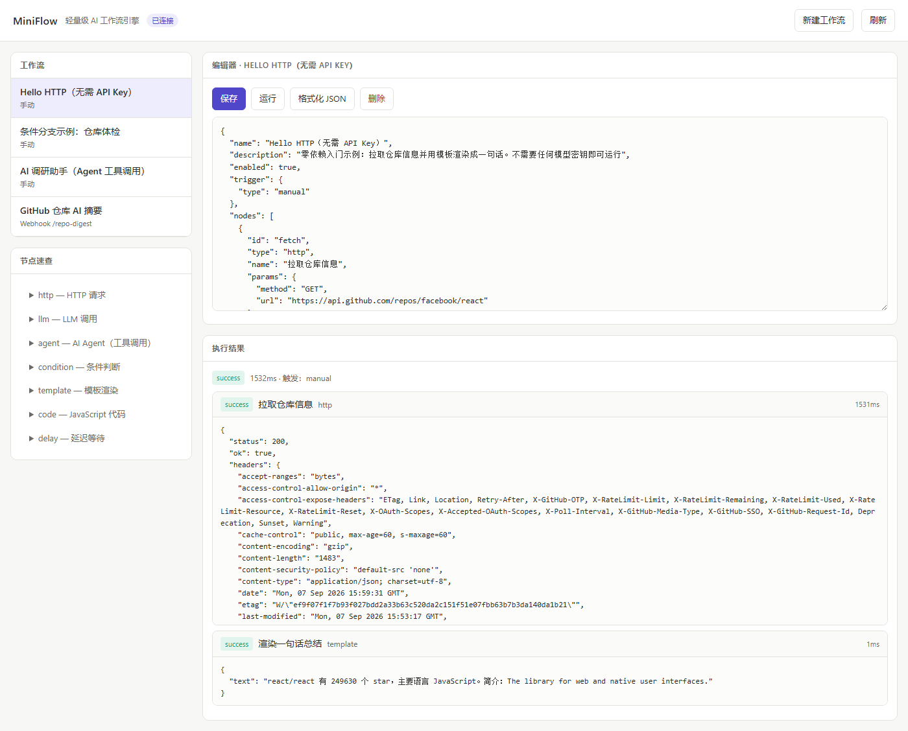
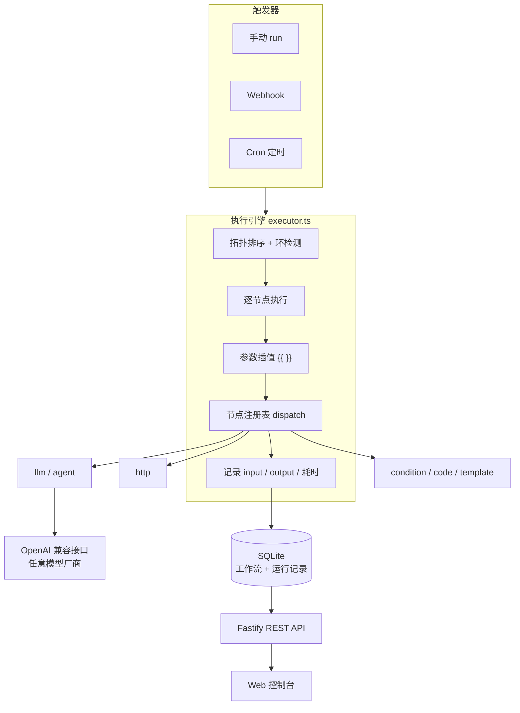

# MiniFlow

> 用 JSON 定义 AI 工作流的轻量自动化引擎。内置 LLM / Agent 节点，单文件数据库，一条命令自部署。

**🌐 [English](./README_EN.md) | 简体中文**


[](https://github.com/XDC-666/miniflow/actions/workflows/ci.yml)


n8n 很强大，但它有几十万行代码、几十个服务依赖，想读懂或二次开发并不容易。
**MiniFlow 想回答一个问题：一个能跑通「触发器 → HTTP → 大模型 → 条件分支」的自动化引擎，最少能写多短？**

答案是：核心代码约 1500 行 TypeScript，5 个运行时依赖，一个 SQLite 文件。

---

## 📸 控制台预览



> 上图：定义一个「拉取 GitHub 仓库信息并渲染成一句话」的工作流，点运行后，下方逐级显示每个节点的输入输出、耗时与最终渲染结果。
> 整张截图就是 `node dist/index.js` + `web/index.html` 真实运行的样子，没有 mock。

---

## ✨ 特性

- **AI 原生**：`llm` 节点支持 system / prompt / 温度 / JSON 结构化输出；`agent` 节点内置 ReAct 工具调用循环，模型可自主决定是否调用 `http_request`、`current_time`，多轮推理后给出结论。
- **任意 OpenAI 兼容模型**：只改一个 `OPENAI_BASE_URL` 即可切换 OpenAI / DeepSeek / Kimi / 通义千问 / 本地 Ollama。
- **声明式工作流**：一个 JSON 文件就是一个工作流，可以进 Git 做版本管理、Code Review、批量分发。
- **分支与跳过**：`condition` 节点 + 连线上的条件表达式，实现 if/else；未走到的分支会被标记为 `skipped` 而不是报错。
- **三种触发方式**：手动调用、Webhook、Cron 定时。
- **零配置存储**：SQLite（WAL 模式），数据就是一个文件。
- **自带控制台**：零依赖的单页 UI，可编辑工作流 JSON、一键运行、逐级查看每个节点的输入输出和耗时。
- **执行可观测**：每次运行都记录每个节点的 input / output / 耗时 / 错误，便于排查 LLM 调用到底哪一步出了问题。

---

## 🚀 快速开始

```bash
git clone https://github.com/XDC-666/miniflow.git
cd miniflow
npm install

cp .env.example .env      # 然后填入你的 OPENAI_API_KEY
npm run dev
```

打开 <http://127.0.0.1:3000> 即可看到控制台。首次启动会自动导入 `examples/` 下的示例工作流（含一个无需 API Key 的 `00-hello-http.json`）。

### 没有 API Key 也能玩

`http` / `condition` / `template` / `code` / `delay` 节点完全不依赖模型。
只有 `llm` 和 `agent` 节点需要密钥。你也可以用本地 Ollama：

```bash
# .env
OPENAI_BASE_URL=http://localhost:11434/v1
LLM_MODEL=qwen2.5:7b
OPENAI_API_KEY=ollama        # 随便填个非空值即可
```

### 命令行体验一次

```bash
# 1) 创建一个工作流
curl -X POST http://127.0.0.1:3000/api/workflows \
  -H "Content-Type: application/json" \
  -d @examples/03-condition-branch.json

# 2) 运行它（wait=1 表示同步等待结果）
curl -X POST "http://127.0.0.1:3000/api/workflows/<上一步返回的 id>/run?wait=1" \
  -H "Content-Type: application/json" -d '{"payload":null}'
```

---

## ⚙️ 环境变量

完整清单见 `.env.example`，常用的几个：

| 变量 | 默认 | 说明 |
| --- | --- | --- |
| `PORT` / `HOST` | `3000` / `127.0.0.1` | 监听地址。改 `0.0.0.0` 会暴露到局域网 |
| `OPENAI_API_KEY` / `OPENAI_BASE_URL` / `LLM_MODEL` | — | 模型服务，兼容 OpenAI 协议，换 base url 即换厂商 |
| `MINIFLOW_CODE_TIMEOUT_MS` | `5000` | code 节点超时，防死循环占满主线程 |
| `MINIFLOW_LLM_TIMEOUT_MS` | `120000` | 模型请求超时，防服务假死拖挂工作流 |
| `MINIFLOW_SAFE_MODE` | `0` | 设为 `1` 禁用 code 节点与表达式求值 |
| `MINIFLOW_EXPOSED_ENV` | 空 | 允许 `$env.XXX` 读取的变量白名单 |
| `MINIFLOW_CORS` / `MINIFLOW_CORS_ORIGINS` | `0` / 空 | 跨域开关与来源白名单 |

---

## 🧩 核心概念

### 工作流就是一个 JSON

```jsonc
{
  "name": "GitHub 仓库 AI 摘要",
  "trigger": { "type": "webhook", "path": "repo-digest" },
  "nodes": [
    {
      "id": "fetch",                       // 节点唯一 ID，供 $node.fetch 引用
      "type": "http",
      "name": "拉取仓库信息",
      "params": {
        "url": "https://api.github.com/repos/{{ $payload.query.repo }}"
      }
    },
    {
      "id": "summarize",
      "type": "llm",
      "name": "生成中文摘要",
      "params": {
        "system": "你是技术专栏编辑，只输出 JSON。",
        "prompt": "请总结：{{ $node.fetch.data.description }}",
        "json": true
      }
    }
  ],
  "edges": [
    { "from": "fetch", "to": "summarize" }       // 有向边，构成 DAG
  ]
}
```

引擎会先做**拓扑排序**并检查环，再按顺序执行。

### 表达式

任何字符串参数里都可以写 `{{ ... }}`，里面是 JS 表达式：

| 变量 | 含义 |
| --- | --- |
| `$json` | 当前节点的上游输入 |
| `$node.<id>` | 某个节点的输出（输出是对象时可直接 `.字段名` 访问） |
| `$node.<id>.json` | 某个节点的完整输出（n8n 风格写法） |
| `$payload` | 触发时传入的数据（Webhook 的 query / body，或手动运行的 payload） |
| `$env.NAME` | 环境变量（**仅限** `MINIFLOW_EXPOSED_ENV` 白名单里的变量） |
| `$runId` / `$now` | 本次运行 ID、当前 ISO 时间 |

```jsonc
"prompt": "{{ $node.fetch.data.full_name }} 有 {{ $node.fetch.data.stargazers_count }} 个 star，用一句话点评"
```

### 分支

`condition` 节点输出 `{ "result": true }`，再在连线上写条件即可实现 if/else：

```jsonc
{ "from": "check", "to": "hot",  "condition": "$json.result === true" },
{ "from": "check", "to": "cold", "condition": "$json.result === false" }
```

没被激活的节点状态是 `skipped`，不会中断整个流程。

---

## 📦 内置节点

| type | 说明 | 输出 |
| --- | --- | --- |
| `http` | 发起 HTTP 请求，JSON 响应自动解析 | `{ status, ok, headers, data }` |
| `llm` | 调用一次大模型，支持 JSON 结构化输出 | `{ text, json, model, usage }` |
| `agent` | ReAct 工具调用循环，最多 N 轮 | `{ text, steps, iterations, toolCalls }` |
| `condition` | 求值表达式 | `{ result: boolean, value }` |
| `code` | 在沙箱中执行一段 JS（可用 `$input` / `$json` / `$node`，支持顶层 `await`，默认 5s 超时） | 任意（由 `return` 决定） |
| `template` | 渲染一段带占位的文本 | `{ text }` |
| `delay` | 等待若干毫秒（上限 5 分钟） | `{ delayedMs }` |

`agent` 节点内置工具：`http_request`（抓取网页 / 调接口）、`current_time`。

**节点级容错**：默认任何节点失败都会中止整条工作流。给节点参数加上 `onError: "continue"`，
该节点失败后流程会继续跑完其余分支（它的下游标记为 `skipped`，整体运行仍记为 `failed`）：

```json
{ "id": "fetch", "type": "http", "params": { "url": "https://...", "onError": "continue" } }
```

想加自己的节点？在 `src/nodes/` 下新建一个文件，调用 `registerNode({...})`，
再到 `src/nodes/index.ts` 里 import 一次 —— API 和 UI 会自动识别它。

---

## ⚡ 触发方式

### 1. 手动

```bash
curl -X POST "http://127.0.0.1:3000/api/workflows/wf_xxx/run?wait=1" \
  -H "Content-Type: application/json" -d '{"payload": {"foo": "bar"}}'
```

不带 `wait=1` 时立即返回 `202 { runId }`，结果写入数据库后可轮询 `GET /api/runs/:id`。

### 2. Webhook

把 `trigger` 配成 `{"type":"webhook","path":"my-hook"}`，然后：

```bash
curl "http://127.0.0.1:3000/api/webhook/my-hook?repo=react/react"
```

工作流里用 `$payload.query`、`$payload.body`、`$payload.headers` 取数据。

### 3. 定时

把 `trigger` 配成 `{"type":"schedule","cron":"0 9 * * *"}`（每天早上 9 点）。
工作流增删改时调度器会自动重建任务，无需重启。

---

## 🔌 REST API

| Method | Path | 说明 |
| --- | --- | --- |
| GET | `/api/health` | 健康检查 |
| GET | `/api/nodes` | 所有节点类型及参数示例 |
| GET | `/api/workflows` | 工作流列表 |
| POST | `/api/workflows` | 创建工作流 |
| GET | `/api/workflows/:id` | 获取单个工作流 |
| PUT | `/api/workflows/:id` | 更新工作流 |
| DELETE | `/api/workflows/:id` | 删除工作流 |
| POST | `/api/workflows/:id/run` | 运行（`?wait=1` 同步等待） |
| GET | `/api/runs` | 运行记录（`?workflowId=&limit=`） |
| GET | `/api/runs/:id` | 单条运行详情（含每个节点的输入输出） |
| DELETE | `/api/runs` | 清理运行记录（`?keep=N` 保留最近 N 条，`?workflowId=` 限定工作流） |
| ALL | `/api/webhook/:path` | Webhook 触发 |
| GET | `/` | Web 控制台 |

---

## 🏗️ 架构



数据流：上游节点的输出写进 `ExecutionContext`，下游节点通过 `$node.<id>` 引用。
每个节点执行完立刻落一条结果，因此即使中途失败，也已经完成的步骤依然可查。

---

## 🔒 安全须知（重要）

MiniFlow 的节点可以执行 JS、对外发起 HTTP 请求，因此**它等价于一台可编程服务器**。请务必注意：

1. **默认只监听 `127.0.0.1`**。`HOST=0.0.0.0` 会把服务暴露到局域网，任何人都能创建工作流并执行任意代码。
2. **表达式与 code 节点都在隔离沙箱中求值**。`{{ }}` 表达式和 `code` 节点都运行在 `vm` 隔离上下文里，
   全局对象与注入数据都被 Proxy 包裹，无法访问 `process` / `require` / `global` 等宿主对象，
   也**无法通过 `.constructor` 链逃逸**读取服务端环境变量。
   需要强调的是：沙箱注入的是**全新 realm** 的内置对象，而不是宿主的 —— 否则
   `Date.constructor('return process')().env.OPENAI_API_KEY` 就能读到全部环境变量
   （这是本项目真实踩过并修复的高危问题，现已用 25 个内置对象 × 2 条链的测试锁住）。
   能创建工作流的人仍视为「可信」，**不要**把服务暴露给不可信用户。
3. **执行有硬超时**。`code` 节点默认 5 秒（`MINIFLOW_CODE_TIMEOUT_MS`），同步死循环与永不 resolve 的 Promise
   都会被中断；LLM 请求默认 120 秒（`MINIFLOW_LLM_TIMEOUT_MS`）。没有超时的话，模型服务假死或
   一句 `while(true){}` 就会让整条工作流乃至整个服务失去响应。
4. **HTTP 节点默认防 SSRF**。`http` 节点与 agent 的 `http_request` 工具会拦截 `localhost`、私网（`10/172.16-31/192.168`）、
   链路本地 / 云元数据（`169.254.169.254`）和 `file://` 等非公网地址，需显式放行内网才能访问。
5. **`$env` 仅暴露白名单变量**。`$env.NAME` 只返回 `MINIFLOW_EXPOSED_ENV` 中列出的变量（默认为空），
   敏感密钥请放在服务端环境变量里，由节点自行读取，不要写进表达式或日志。
6. **多租户 / 公开场景请开启 `MINIFLOW_SAFE_MODE=1`**，这会禁用 `code` 节点和所有 `{{ }}` 表达式求值（仅保留字面量与静态配置）。
7. **`.env` 已在 `.gitignore` 中**。提交前请确认没有把真实密钥写进仓库；
   如果发生过泄露，光覆盖文件是不够的 —— 去厂商后台**吊销并重新生成**该密钥。
8. **Webhook 端点没有鉴权**。若要对公网开放，请在前面加一层反向代理鉴权。

> 注意：`code` 节点运行在沙箱内，因此**不能使用 `require` / `process`**（可用 `$input` / `$json` / `$node`，
> 并支持顶层 `await`）。需要 `require` 的逻辑请改成自定义节点。

---

## 📁 目录结构

```
miniflow/
├── src/
│   ├── engine/          # 引擎核心
│   │   ├── types.ts     #   工作流 Schema（zod）
│   │   ├── executor.ts  #   拓扑排序 + 执行调度 + 分支
│   │   └── context.ts   #   执行上下文与 $node / $json 作用域
│   ├── nodes/           # 节点实现（新增节点放这里）
│   ├── llm/             # OpenAI 兼容模型客户端
│   ├── store/           # SQLite 持久化
│   ├── utils/           # 插值沙箱、SSRF 校验
│   ├── scheduler.ts     # Cron 定时调度
│   ├── runner.ts        # 运行编排（同步 / 异步）
│   ├── server.ts        # Fastify REST API
│   └── index.ts         # 入口
├── test/                # 测试（安全 / 引擎 / 存储 / 接口）
├── .github/             # CI 与 Dependabot 配置
├── web/index.html       # 零依赖单页控制台
├── examples/            # 可直接导入的示例工作流
└── data/                # SQLite 数据库（自动生成，已 gitignore）
```

---

## 🧪 开发与测试

```bash
npm install
npm run dev        # 热重载启动
npm run verify     # 类型检查 + 全部测试（提交前必跑）
npm test           # 只跑测试
npm run typecheck  # 只做类型检查（覆盖 src/ 与 test/）
```

测试分四组，共 39 项：

| 文件 | 覆盖内容 |
|---|---|
| `test/security.test.ts` | 沙箱逃逸（含 25 个内置对象 × 2 条 constructor 链）、`process.env` 不可达、SSRF 拦截、code 节点超时 |
| `test/engine.test.ts` | 拓扑排序、条件分支、跳过语义、失败中断、`onError: continue` 容错、payload 传递 |
| `test/store.test.ts` | 工作流 CRUD、运行记录与 limit 边界、清理与瘦身 |
| `test/api.test.ts` | 各 REST 接口的状态码与校验（用 `fastify.inject`） |

改动沙箱 / SSRF / 表达式相关代码时，安全用例是**硬性闸门**。
详见 [CONTRIBUTING.md](./CONTRIBUTING.md)。

---

## 🗺️ 路线图

- [x] 执行超时（code 节点 5s / LLM 请求 120s）
- [x] 节点级容错 `onError: continue`（失败不中断整条流程）
- [ ] 节点级失败重试
- [ ] 并行执行无依赖的分支
- [ ] 拖拽式可视化编排（当前是 JSON 编辑）
- [ ] 更多内置工具（`search_web`、`read_file`、数据库查询）
- [ ] 工作流导入 / 导出与模板市场
- [ ] 基础鉴权（API Key / 简单账号体系）

欢迎提 Issue 和 PR。

---

## ❓ 与 n8n 的区别

|  | n8n | MiniFlow |
| --- | --- | --- |
| 定位 | 生产级自动化平台 | 可读懂、可改造的极简内核 |
| 代码量 | 数十万行 | ~1500 行核心 |
| 节点数量 | 400+ | 7 个（但覆盖 AI 场景主干） |
| 编排方式 | 拖拽 + 可视化 | JSON 声明式 |
| 部署 | 多服务 / Docker | `npm install && npm run dev` |
| 适合 | 企业生产环境 | 学习原理、二次开发、个人自动化 |

如果你的目标是「看懂一个工作流引擎是怎么工作的，并按需改造它」，MiniFlow 是为此设计的。

---

## 📄 License

[MIT](./LICENSE)
