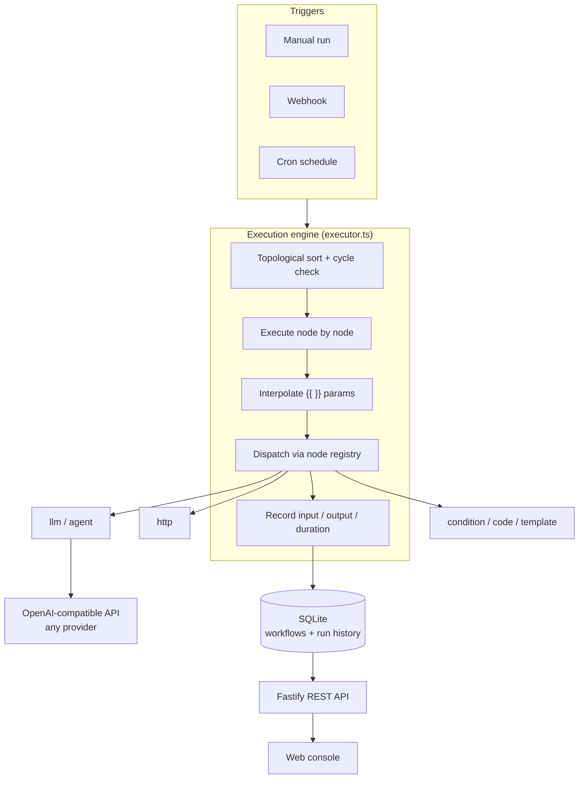

# MiniFlow

> A lightweight AI workflow automation engine — define DAG workflows in JSON, with built-in LLM & Agent nodes, a single-file database, and one-command self-hosting.
>
> 简体中文版请见 [README.md](./README.md)


n8n is powerful — but it ships hundreds of thousands of lines and dozens of services, which makes it hard to read or fork.
**MiniFlow asks a different question: how short can an automation engine be and still run "trigger → HTTP → LLM → conditional branch"?**

Answer: about **1,500 lines** of TypeScript, **5 runtime dependencies**, and **one SQLite file**.

---

## 📸 Console preview


> A workflow that fetches a GitHub repo and renders a one-line summary. After clicking *Run*, every node's input, output, and duration are listed below.
> This is a real screenshot of `node dist/index.js` + `web/index.html` — no mock data.

---

## ✨ Features

- **AI-native.** The `llm` node supports system / prompt / temperature / structured JSON output. The `agent` node ships a ReAct tool-calling loop, so the model decides on its own whether to call `http_request` or `current_time`, and reasons across multiple turns before answering.
- **Any OpenAI-compatible model.** Switch providers by changing one `OPENAI_BASE_URL` — OpenAI, DeepSeek, Moonshot Kimi, Qwen, or a local Ollama.
- **Declarative workflows.** One JSON file = one workflow. Version it in Git, review it in PRs, ship it in batches.
- **Branching without breakage.** A `condition` node plus per-edge conditions gives you if/else. Untaken branches are marked `skipped` instead of failing the run.
- **Three trigger types.** Manual, Webhook, and Cron.
- **Zero-config storage.** SQLite in WAL mode — your data is a single file.
- **Built-in console.** A dependency-free single-page UI: edit the workflow JSON, run it in one click, and inspect each node's input/output and timing.
- **Observable runs.** Every execution records each node's input, output, duration, and error — so you can see exactly which step broke in an LLM chain.

---

## 🚀 Quick start

```bash
git clone https://github.com/XDC-666/miniflow.git
cd miniflow
npm install

cp .env.example .env      # then fill in your OPENAI_API_KEY
npm run dev
```

Open <http://127.0.0.1:3000>. On first launch, the example workflows in `examples/` are imported automatically.

### No API key? You can still use it

The `http`, `condition`, `template`, `code`, and `delay` nodes never touch a model.
Only `llm` and `agent` need a key — and you can point them at a local Ollama instead:

```bash
# .env
OPENAI_BASE_URL=http://localhost:11434/v1
LLM_MODEL=qwen2.5:7b
OPENAI_API_KEY=ollama        # any non-empty value works
```

### Try it from the CLI

```bash
# 1) Create a workflow
curl -X POST http://127.0.0.1:3000/api/workflows \
  -H "Content-Type: application/json" \
  -d @examples/03-condition-branch.json

# 2) Run it (wait=1 blocks until it finishes)
curl -X POST "http://127.0.0.1:3000/api/workflows/<id-from-step-1>/run?wait=1" \
  -H "Content-Type: application/json" -d '{"payload":null}'
```

---

## 🧩 Core concepts

### A workflow is just JSON

```jsonc
{
  "name": "GitHub repo AI digest",
  "trigger": { "type": "webhook", "path": "repo-digest" },
  "nodes": [
    {
      "id": "fetch",                    // unique id, referenced as $node.fetch
      "type": "http",
      "name": "Fetch repo",
      "params": {
        "url": "https://api.github.com/repos/{{ $payload.query.repo }}"
      }
    },
    {
      "id": "summarize",
      "type": "llm",
      "name": "Summarize",
      "params": {
        "system": "You are a tech editor. Only output JSON.",
        "prompt": "Summarize: {{ $node.fetch.data.description }}",
        "json": true
      }
    }
  ],
  "edges": [
    { "from": "fetch", "to": "summarize" }        // directed edge, forming a DAG
  ]
}
```

The engine topologically sorts the graph, rejects cycles, and then executes in order.

### Expressions

Any string parameter can embed `{{ ... }}` containing a JavaScript expression:

| Variable | Meaning |
| --- | --- |
| `$json` | Upstream input of the current node |
| `$node.<id>` | Output of a node (access fields directly when the output is an object) |
| `$node.<id>.json` | Full output of a node (n8n-style access) |
| `$payload` | Data passed in at trigger time (webhook query/body, or manual payload) |
| `$env.NAME` | Environment variable (**only** those listed in `MINIFLOW_EXPOSED_ENV`) |
| `$runId` / `$now` | Current run id, current ISO timestamp |

```jsonc
"prompt": "{{ $node.fetch.data.full_name }} has {{ $node.fetch.data.stargazers_count }} stars — describe it in one sentence"
```

### Branching

A `condition` node outputs `{ "result": true }`; add a condition to each outgoing edge to build if/else:

```jsonc
{ "from": "check", "to": "hot",  "condition": "$json.result === true" },
{ "from": "check", "to": "cold", "condition": "$json.result === false" }
```

Nodes that never get activated are marked `skipped` and do not abort the run.

---

## 📦 Built-in nodes

| type | Description | Output |
| --- | --- | --- |
| `http` | HTTP request; JSON responses are parsed automatically | `{ status, ok, headers, data }` |
| `llm` | One LLM call with optional structured JSON output | `{ text, json, model, usage }` |
| `agent` | ReAct tool-calling loop, up to N iterations | `{ text, steps, iterations, toolCalls }` |
| `condition` | Evaluate an expression | `{ result: boolean, value }` |
| `code` | Run a snippet of JS (`$input`, `$node` available) | Whatever you `return` |
| `template` | Render text with placeholders | `{ text }` |
| `delay` | Wait N milliseconds (max 5 minutes) | `{ delayedMs }` |

The `agent` node ships two tools: `http_request` (fetch a page or call an API) and `current_time`.

**Adding your own node:** create a file under `src/nodes/`, call `registerNode({...})`, then import it once in `src/nodes/index.ts`. Both the API and the UI pick it up automatically.

---

## ⚡ Triggers

### 1. Manual

```bash
curl -X POST "http://127.0.0.1:3000/api/workflows/wf_xxx/run?wait=1" \
  -H "Content-Type: application/json" -d '{"payload": {"foo": "bar"}}'
```

Without `wait=1` it returns `202 { runId }` immediately; poll `GET /api/runs/:id` for the result.

### 2. Webhook

Set the trigger to `{"type":"webhook","path":"my-hook"}`, then:

```bash
curl "http://127.0.0.1:3000/api/webhook/my-hook?repo=react/react"
```

Read the data with `$payload.query`, `$payload.body`, and `$payload.headers`.

### 3. Schedule

Set the trigger to `{"type":"schedule","cron":"0 9 * * *"}` (every day at 09:00).
The scheduler rebuilds jobs automatically whenever workflows change — no restart needed.

---

## 🔌 REST API

| Method | Path | Description |
| --- | --- | --- |
| GET | `/api/health` | Health check |
| GET | `/api/nodes` | All node types with example params |
| GET | `/api/workflows` | List workflows |
| POST | `/api/workflows` | Create a workflow |
| GET | `/api/workflows/:id` | Get one workflow |
| PUT | `/api/workflows/:id` | Update a workflow |
| DELETE | `/api/workflows/:id` | Delete a workflow |
| POST | `/api/workflows/:id/run` | Run it (`?wait=1` to block) |
| GET | `/api/runs` | Run history (`?workflowId=&limit=`) |
| GET | `/api/runs/:id` | Run detail, including every node's I/O |
| ALL | `/api/webhook/:path` | Webhook trigger |
| GET | `/` | Web console |

---

## 🏗️ Architecture



Each node's output is written into an `ExecutionContext`, and downstream nodes reference it via `$node.<id>`.
Results are persisted per node as they finish, so even a failed run keeps every step that succeeded.

---

## 🔒 Security notes (please read)

MiniFlow nodes can execute JavaScript and issue arbitrary HTTP requests — **it is effectively a programmable server**:

1. **It binds to `127.0.0.1` by default.** Setting `HOST=0.0.0.0` exposes it to your network, where anyone could create a workflow and run arbitrary code.
2. **`$env` is not exposed wholesale.** It only returns variables explicitly allow-listed in `MINIFLOW_EXPOSED_ENV` (empty by default). This prevents API keys from leaking into prompts or run logs — keep secrets in server-side env vars and let nodes read them directly.
3. **Enable `MINIFLOW_SAFE_MODE=1` for multi-tenant setups.** This disables the `code` node and all `{{ }}` expression evaluation.
4. **`.env` is git-ignored.** Verify no real key reaches the repo. If one does, overwriting the file is not enough — **revoke and regenerate** that key at the provider.
5. **Webhook endpoints have no authentication.** Put a reverse proxy with auth in front if you expose them publicly.

---

## 📁 Project structure

```
miniflow/
├── src/
│   ├── engine/          # Engine core
│   │   ├── types.ts     #   Workflow schema (zod)
│   │   ├── executor.ts  #   Topological sort + scheduling + branching
│   │   └── context.ts   #   Execution context and $node / $json scope
│   ├── nodes/           # Node implementations (add yours here)
│   ├── llm/             # OpenAI-compatible model client
│   ├── store/           # SQLite persistence
│   ├── scheduler.ts     # Cron scheduler
│   ├── runner.ts        # Run orchestration (sync / async)
│   ├── server.ts        # Fastify REST API
│   └── index.ts         # Entry point
├── web/index.html       # Dependency-free single-page console
├── examples/            # Importable example workflows
└── data/                # SQLite database (auto-created, git-ignored)
```

---

## 🗺️ Roadmap

- [ ] Per-node retry and timeout configuration
- [ ] Parallel execution of independent branches
- [ ] Drag-and-drop visual editor (currently JSON editing)
- [ ] More built-in tools (`search_web`, `read_file`, database queries)
- [ ] Workflow import/export and a template gallery
- [ ] Basic authentication (API key / simple accounts)

Issues and PRs are welcome.

---

## ❓ How it compares to n8n

|  | n8n | MiniFlow |
| --- | --- | --- |
| Goal | Production automation platform | A minimal core you can actually read and modify |
| Code size | Hundreds of thousands of lines | ~1,500 lines of core |
| Node count | 400+ | 7 (covering the main AI use cases) |
| Authoring | Drag-and-drop canvas | Declarative JSON |
| Deployment | Multiple services / Docker | `npm install && npm run dev` |
| Best for | Enterprise production | Learning the internals, forking, personal automation |

If you want to understand how a workflow engine actually works — and change it to fit your needs — MiniFlow is built for that.

---

## 📄 License

[MIT](./LICENSE)
